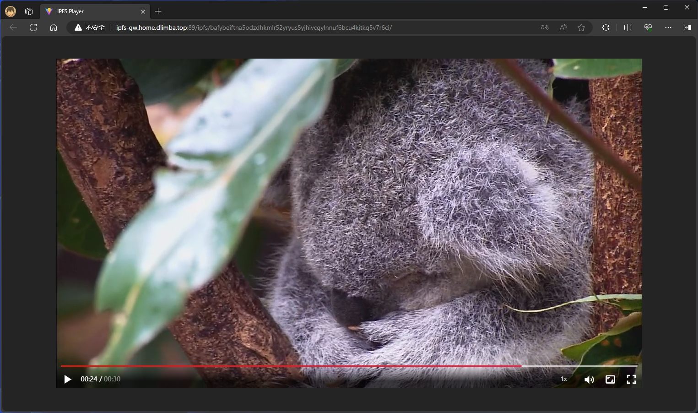

# ipfs-player
# 基于ipfs的视频播放器

> 播放器将在ipfs网络上发布，用户可以使用IPFS网关进行访问。

演示地址：[Demo1](http://ipfs-gw.home.dlimba.top:89/ipfs/bafybeiesjodc2whdevwvu4f5cvjisdjh7vi3etwyfh6xa2f7zsdl7froo4/)

播放器有3种数据加载方式：
1. 内建files.json方式：

2. 浏览器路径中指定files.json的hash:

3. 浏览器路径中指定files.json的路径:

更多演示地址： 使用自定义IPFS网关 http://ipfs-gw.home.dlimba.top:89/ipfs/:hash

|      数据加载方式       | 播放MP4                                                                                                                                                                                                | 播放M3U8                                                                                                                                                                                               |
|:-----------------:|------------------------------------------------------------------------------------------------------------------------------------------------------------------------------------------------------|------------------------------------------------------------------------------------------------------------------------------------------------------------------------------------------------------|
|   内建files.json    | [Demo1](http://ipfs-gw.home.dlimba.top:89/ipfs/bafybeiesjodc2whdevwvu4f5cvjisdjh7vi3etwyfh6xa2f7zsdl7froo4/)                                                                                         | [Demo4](http://ipfs-gw.home.dlimba.top:89/ipfs/bafybeiftna5odzdhkmlr52yryus5yjhivcgylnnuf6bcu4kjtkq5v7r6ci/)                                                                                         |
| 指定files.json的hash | [Demo2](http://ipfs-gw.home.dlimba.top:89/ipfs/bafybeiesjodc2whdevwvu4f5cvjisdjh7vi3etwyfh6xa2f7zsdl7froo4/#files.json=bafkreigorocsvshb6udcomwtpdhpugs7adoqckqrrsvl7hf5suonxf5kqq)                  | [Demo5](http://ipfs-gw.home.dlimba.top:89/ipfs/bafybeiesjodc2whdevwvu4f5cvjisdjh7vi3etwyfh6xa2f7zsdl7froo4/#files.json=bafkreifrlfvljttht4tud3zpzxndjrwddgpv7sqfzl34kqbgviernbgqna)                  |
|  指定files.json的路径  | [Demo3](http://ipfs-gw.home.dlimba.top:89/ipfs/bafybeiesjodc2whdevwvu4f5cvjisdjh7vi3etwyfh6xa2f7zsdl7froo4/#files.json=/ipfs/bafybeiesjodc2whdevwvu4f5cvjisdjh7vi3etwyfh6xa2f7zsdl7froo4/files.json) | [Demo6](http://ipfs-gw.home.dlimba.top:89/ipfs/bafybeiesjodc2whdevwvu4f5cvjisdjh7vi3etwyfh6xa2f7zsdl7froo4/#files.json=/ipfs/bafybeiftna5odzdhkmlr52yryus5yjhivcgylnnuf6bcu4kjtkq5v7r6ci/files.json) |
