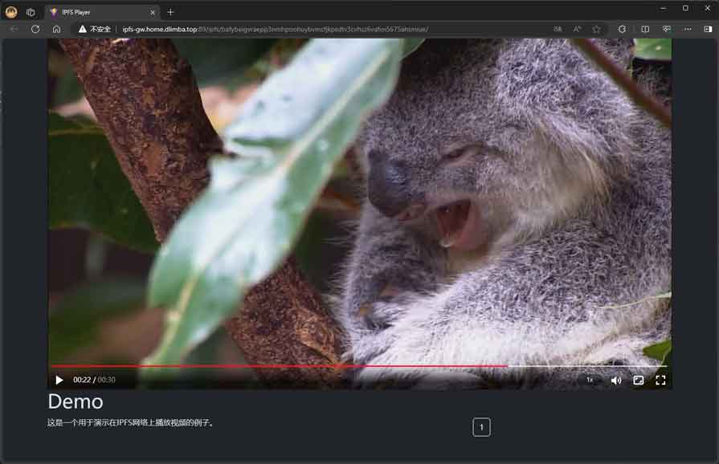

# ipfs-player
# 基于ipfs的视频播放器

> 播放器将在ipfs网络上发布，用户可以使用IPFS网关进行访问。

演示地址：[Demo1](http://ipfs-gw.home.dlimba.top:89/ipfs/bafybeiggaefsr2rzw43nubqhfkrldgihkee4i3rilnrprtaqw5muiewgdy/)

播放器有3种数据加载方式：
1. 内建files.json方式：

2. 浏览器路径中指定files.json的hash:

3. 浏览器路径中指定files.json的路径:

更多演示地址： [点击进入更多演示地址]( http://ipfs-video.home.dlimba.top:89/)
使用自定义IPFS网关 http://ipfs-gw.home.dlimba.top:89/ipfs/:hash

|      数据加载方式       | 播放MP4                                                                                                                                                                                                | 播放M3U8                                                                                                                                                                                               |
|:-----------------:|------------------------------------------------------------------------------------------------------------------------------------------------------------------------------------------------------|------------------------------------------------------------------------------------------------------------------------------------------------------------------------------------------------------|
|   内建files.json    | [Demo1](http://ipfs-gw.home.dlimba.top:89/ipfs/bafybeiggaefsr2rzw43nubqhfkrldgihkee4i3rilnrprtaqw5muiewgdy/)                                                                                         | [Demo4](http://ipfs-gw.home.dlimba.top:89/ipfs/bafybeig6bm5azctfigunici4rrt4du7vsnru53fiekjjy5zmmluvtosgg4/)                                                                                         |
| 指定files.json的hash | [Demo2](http://ipfs-gw.home.dlimba.top:89/ipfs/bafybeiggaefsr2rzw43nubqhfkrldgihkee4i3rilnrprtaqw5muiewgdy/#files.json=bafkreidxpp6jgyral6mumbydufrrit7hyeqboubkoqkalqleamky3qvcoq)                  | [Demo5](http://ipfs-gw.home.dlimba.top:89/ipfs/bafybeiggaefsr2rzw43nubqhfkrldgihkee4i3rilnrprtaqw5muiewgdy/#files.json=bafkreiaaqgt3iqszfg22qgalatm3vxxiappw4tfh5ujeoes4i7gjk7w4ge)                  |
|  指定files.json的路径  | [Demo3](http://ipfs-gw.home.dlimba.top:89/ipfs/bafybeiggaefsr2rzw43nubqhfkrldgihkee4i3rilnrprtaqw5muiewgdy/#files.json=/ipfs/bafybeigvraepp3nmhpoohuybvmcfjkpsdtv3cvhsz6vafxn5675ahsmiue/files.json) | [Demo6](http://ipfs-gw.home.dlimba.top:89/ipfs/bafybeiggaefsr2rzw43nubqhfkrldgihkee4i3rilnrprtaqw5muiewgdy/#files.json=/ipfs/bafybeidvdwluytvf2f5e374lk5kvcg63ivdvbwvixmrreb43725xtot73i/files.json) |

# 捐赠

Filecoin: f1rqets7sph2c3vvrdn65fqepk5wwesr6766ehmti  
ETH: 0x8fEEdB4ceC6C2357aD75dB7d65691297d04498cf

# 鸣谢
[IPFS](https://github.com/ipfs/kubo)  
[Filecoin](https://github.com/filecoin-project/lotus)  
[AWS](https://aws.amazon.com/)  
[vite](https://vitejs.cn/)  
[xgplayer](https://h5player.bytedance.com/)  